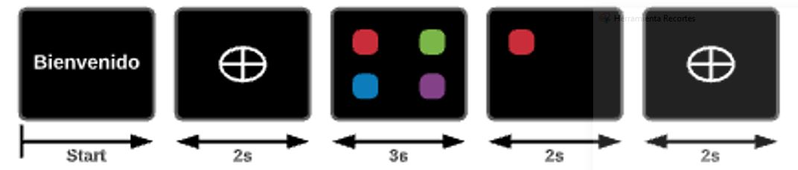
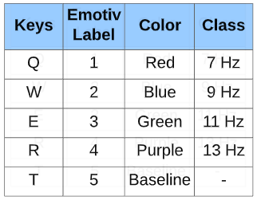

# EEG Signal's project

## Introduction
Two types of visual stimuli were developed: based on frequency and evoked potential P300, data was collected from 9 subjects initially.

### Types of experiment
- Color experiment
  - Frecuency based
  - Evoked potential P300
- Experiment in white
  - Frecuency based
### Visual Stimuli
Two experiments were designed: frecuency based and evoked potential P300, the codes were developed in Matlab 2020, using the open source library Psychtoolbox.
#### Frecuency based
The frecuencies used were 7hz, 9Hz, 11Hz and 13Hz in the case of the experiment ran in colors those frecuencies were associated with the colors blue, red, green and purple, respectively, however in the second experiment all the stimuli were in white. The squares oscillated one at a time, while the others remained opaque, as shown in the figure.

#### Evoked potential P300
The stimulis oscillated at a random frecuency, then three of the squares disappeared and just one remained on the frame, in theory this generated the P300 stimuli.

### Emotiv EPOC
Emotiv EPOC headset is a 14 channel wireless EEG headset that registers brain signals (µV) through different softwares, in this project we  used EMOTIV-PRO, the app comes with several features, however we only focused on the registration, labeling and data exportation. In the app's settings, the keys associated to the labels were configured as shoen in the following table.

