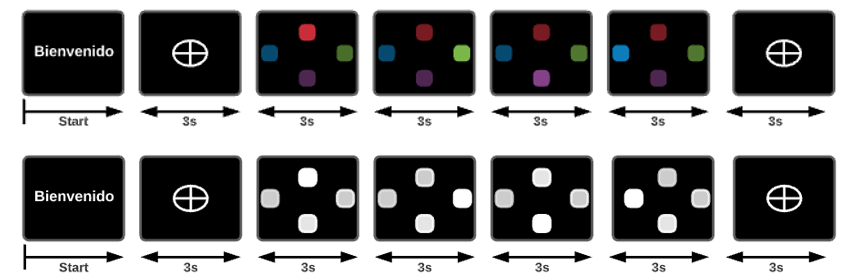

# EEG Signal's project

## Introduction
### Types of experiment
- Color experiment
  - Frecuency based
  - Evoked potential P300
- Experiment in white
  - Frecuency based
### Visual Stimuli
Two experiments were designed: frecuency based and evoked potential P300, the codes were developed in Matlab 2020, using the open source library Psychtoolbox.
#### Frecuency based
The frecuencies used were 7hz, 9Hz, 11Hz and 13Hz in the case of the experiment ran in colors those frecuencies were associated with the colors blue, red, green and purple, respectively, however in the second experiment all the stimuli were in white.

#### Evoked potential P300
The stimulis oscillated at a random frecuency, then three of the squares disappeared and just one remained on the frame,in theory this generated the P300 stimuli.

Se desarrollaron dos tipos de estímulos visuales: basado en frecuencia y potencial evocado P300, se recogieron los datos de 9 sujetos inicialmente.  
Procesamiento y clasificación de senales EEG
