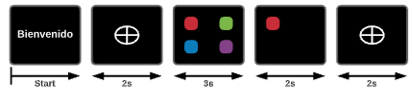

# EEG Signal's project

## Introduction
The following experiment aims to analyze EEG signals and classify them into four classes using AI techniques. During the execution of it we used *Matlab*, to design the stimulis, the *Emotiv EPOC* headset, to register the electrodes' data and *Python*, for data processing. Initially the experiment was designed in different colors, then for experimentation purposes we tried it only in white. The experiment process was subdivided in four main stages for organization purposes, as shown below.

### Types of experiment
- Color experiment
  - Frecuency based
  - Evoked potential P300
- Experiment in white
  - Frecuency based
## Visual stimuli designing
Two experiments were designed: ***frecuency based*** and ***evoked potential P300***, the codes were developed in *Matlab 2020*, using the open source library [*Psychtoolbox*](http://psychtoolbox.org/download).
### Frecuency based
The frecuencies used were 7hz, 9Hz, 11Hz and 13Hz, in the case of the experiment ran in color, those frecuencies were associated with the colors red, blue, green and purple, respectively, however in the second experiment all the stimuli were shown in white. Each square oscillated at a designated frecuency during 3 sec, while the others remained opaque and still, as shown in the figure.

### Evoked potential P300
The stimulis oscillated at a random frecuency, then three of the squares disappeared and just one remained on the frame, in theory this generated the P300 stimuli.

## Data recording
For data registration the [***Emotiv EPOC+ headset***](https://emotiv.gitbook.io/epoc-user-manual/introduction-1/about#:~:text=The%20EMOTIV%20EPOC%2B%20is%20a%20portable%2C%20high%20resolution%2C,used%20for%20research%20applications%20and%20personal%20use%20only.) was used, it is a 14 channel wireless EEG headset with a sampling rate of 128 Hz, that registers brain signals (in µV) through different softwares, in this project we  used the EMOTIV-PRO app, it comes with several features, however we only focused on the registration, labeling and data exportation. In the app's settings, the keys associated to the labels were configured as shown in the image below.

Although data from all the electrodes was collected and registered, as a first stage, we based our analysis only on the responses of the occipital area of the brain, two electrodes are placed in that zone: Occipital 1 (EEG.O1) and Occipital (EEG.O2).

The experiments lasted approximately 11 minutes, the records were exported as csv files:
- Color experiment: [Color Data](https://github.com/kaviles22/SenalesEEG/tree/main/Colores/DatosBrutos) 
- Experiment in white: [White Data](https://github.com/kaviles22/SenalesEEG/tree/main/Blanco/DatosBrutos)
- 
## Data pre-processing 
### Data categorization
Once the data was exported we focused on processing the raw data files in order to only maintain the information in which we were going to focus, those rows were: ***MarkerValueInt*** (Label), ***EEG.O1*** and ***EEG.O2***. The data was divided into files, using the [pre-processing.ipynb](https://github.com/kaviles22/SenalesEEG/tree/main/src/Pre-Procesado.ipynb) file, each file represented a *temporary window*, which is understood as the time at which the subject was exposed to an specific stimuli, in this case each temporary window represented a 3 second recording. The files were categorized into the respective folders depending on their labels, as shown below.

### Signal processing
After data categorization was made, some processing took place in order to improve future data analysis, different signal processing were applied, and each modified file was saved into a different sub-category or sub-folder.

.png)

### Raw Data
This folder contains the raw data, as exported from Emotiv PRO app, no processing or filtering was done to this group of data.
### Raw Data Outliers
Outliers are aberrant values presented in the registered data, those values were replaced with the mean value of the respective row.
### Raw Data Filtered
A [*Butterworth filter*](https://en.wikipedia.org/wiki/Butterworth_filter) was applied, the frecuency range was set between 5 Hz and 30 Hz.
### Raw Data Hilbert
The [*Hilbert transform*](https://en.wikipedia.org/wiki/Hilbert_transform) was applied.
### Raw Data Filtered & Hilbert
The Hilbert transform was applied to the filtered data.

## Feature extraction
Once all the files were sorted into their respective folders, features were extracted from all the data. Two main ways were proposed to extract them:
1. [**Tsfresh**](https://tsfresh.readthedocs.io/en/latest/) /n
   Tsfresh is a python package which has differents methods to extract and analyze several features from a given data. 
2. **Developing our own feature extraction algorithm**
    We developed an algorithm to extract features of our choice:
    - Mean absolute value:
    - Mean absolute value - type I: 
    - Mean absolute value - type II: 
    - Log Detection: 
    - Median Absolute Value: 
    - Variance: 
    - Mean Absolute Difference Value: 
    - Mean Frequency
    - Frecuency at maximum PSD:
    - Variance of the Central Frequency:  
    - Maximum PSD:
    - Amplitude Histogram:
